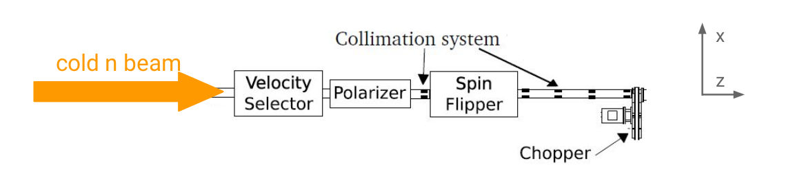
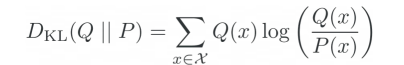
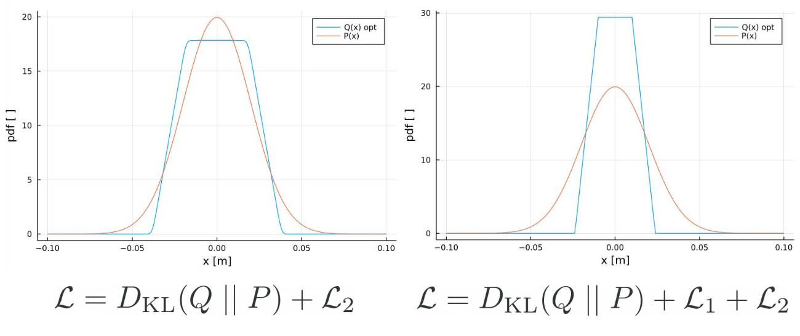

# NobleAD

_NobleAD_ (**N**eutr**O**n **B**eam **L**ine s**E**tup with **A**utomatic **D**ifferentiation) is a Julia package 
for optimizing a neutron beam line with absorbing apertures with differential programming.
This repository is complementary material to the publication 
_"Toward the End-to-End Optimization of Particle Physics Instruments with Differentiable Programming: a White Paper"_
[[Dorigo et al.]](https://arxiv.org/abs/2203.13818).

### PERKEO III example

To further illustrate the capabilities of differentiable programming for low-energy particle physics,
we choose the optimization of a neutron beamline as found in measurements with the PERKEO III instrument. 
Consider a source of cold neutrons whose neutrons reach an experiment through neutron guides and a velocity selector. 
We position a set of n quadratic neutron apertures between the velocity selector and the experiment to shape the resulting beam distribution.
The beam distribution can be calculated analytically by trigonometry and a set of integrals, requiring no surrogate model.
Optimizing the beam distribution is essential to reduce systematic effects, maintain experiment confinements, or other constraints like costs.
The two most significant systematic effects are beam homogeneity and created background signals by the beamline through neutron absorption.

### Objective value composition

We can encode the desired beam homogeneity or shape in a target distribution P(x) with x being the distance perpendicular to the beam center.
Therefore, we set the optimization objective as Kullback-Leibler divergence or _relative entropy_ DKL  
of P(x) and the resulting beam distribution of the current setup Q(x) for a fixed detector position on the beam axis

Furthermore, we can expand the objective value with additional terms addressing different systematic effects.
It is beneficial to place apertures further away from the experiment to minimize beamline-induced background. 
We add the distance pi of aperture i to the beamline start as the first objective function adaption as

with weighting parameter &alpha;1. We also add aperture width wi of aperture i as regularization

Therefore, the total optimization objective $\mathcal{L}$ for the differential programming pipeline can be any combination of the three terms.
We keep the model very general, as further details are experiment specific. 

### Optimization examples

Here are some example results with differently composed objective value functions. We chose a Gaussian target distribution.

Two different optimized beamline distributions Q(x) for n = 3 apertures.
(Left) uses only DKL and $\mathcal{L}_2$, enforcing a good distribution approximation of P(x) with equally sized apertures. 
(Right) utilizes all objective value terms, sacrificing function approximation quality for less background signals.

